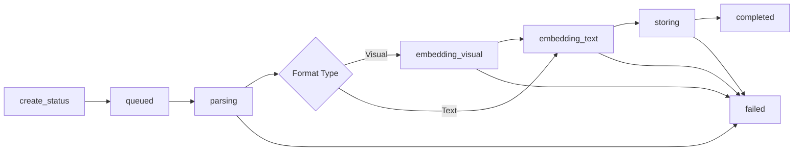

# StatusManager Contract

**Provider**: status-persistence-agent
**Consumers**: api-endpoints-agent, processing-agent
**Wave**: 1
**Status**: Specification

## Overview

The StatusManager class provides a thread-safe wrapper around the global `processing_status` dictionary. It ensures consistent access patterns, automatic cleanup, and structured status updates.

## Class Interface

### StatusManager

```python
class StatusManager:
    """Thread-safe manager for document processing status."""

    def __init__(self):
        """Initialize StatusManager with existing processing_status dict."""
        pass

    def create_status(
        self,
        doc_id: str,
        filename: str,
        metadata: Dict[str, Any]
    ) -> ProcessingStatus:
        """
        Create a new processing status entry.

        Args:
            doc_id: Unique document identifier (SHA-256 hash)
            filename: Original filename
            metadata: Document metadata (format, size, etc.)

        Returns:
            ProcessingStatus object

        Raises:
            ValueError: If doc_id already exists
        """
        pass

    def get_status(self, doc_id: str) -> Optional[ProcessingStatus]:
        """
        Retrieve status for a specific document.

        Args:
            doc_id: Document identifier

        Returns:
            ProcessingStatus object or None if not found
        """
        pass

    def update_status(
        self,
        doc_id: str,
        status: str,
        progress: float,
        **kwargs
    ) -> None:
        """
        Update processing status for a document.

        Args:
            doc_id: Document identifier
            status: New status value
            progress: Progress value (0.0-1.0)
            **kwargs: Additional fields (stage, page, etc.)

        Raises:
            KeyError: If doc_id doesn't exist
            ValueError: If progress out of range
        """
        pass

    def list_active(self) -> List[ProcessingStatus]:
        """
        Get all documents currently being processed.

        Returns:
            List of ProcessingStatus objects with status != completed/failed
        """
        pass

    def list_all(self, limit: int = 100) -> List[ProcessingStatus]:
        """
        Get all documents in status tracker.

        Args:
            limit: Maximum number of results

        Returns:
            List of ProcessingStatus objects (most recent first)
        """
        pass

    def cleanup_old_entries(self, max_age_seconds: int = 3600) -> int:
        """
        Remove completed/failed entries older than max_age.

        Args:
            max_age_seconds: Max age in seconds (default: 1 hour)

        Returns:
            Number of entries removed
        """
        pass

    def mark_completed(self, doc_id: str, **kwargs) -> None:
        """
        Mark document as completed.

        Args:
            doc_id: Document identifier
            **kwargs: Additional metadata (num_chunks, storage_ids, etc.)

        Raises:
            KeyError: If doc_id doesn't exist
        """
        pass

    def mark_failed(self, doc_id: str, error: str) -> None:
        """
        Mark document as failed.

        Args:
            doc_id: Document identifier
            error: Error message

        Raises:
            KeyError: If doc_id doesn't exist
        """
        pass
```

---

## Data Models

### ProcessingStatus

```python
from pydantic import BaseModel, Field
from typing import Optional, Dict, Any
from datetime import datetime

class ProcessingStatus(BaseModel):
    """Status model for document processing."""

    doc_id: str = Field(..., description="SHA-256 document hash")
    filename: str = Field(..., description="Original filename")

    # Status tracking
    status: str = Field(
        ...,
        description="Current status",
        pattern="^(queued|parsing|embedding_visual|embedding_text|storing|completed|failed)$"
    )
    progress: float = Field(..., ge=0.0, le=1.0, description="Progress 0.0-1.0")
    stage: str = Field(..., description="Human-readable current stage")

    # Progress details
    page: Optional[int] = Field(None, description="Current page number")
    total_pages: Optional[int] = Field(None, description="Total pages")

    # Timing
    started_at: datetime = Field(..., description="Processing start time (UTC)")
    updated_at: datetime = Field(..., description="Last update time (UTC)")
    completed_at: Optional[datetime] = Field(None, description="Completion time (UTC)")
    elapsed_time: float = Field(..., description="Seconds since start")
    estimated_remaining: Optional[float] = Field(None, description="Estimated seconds remaining")

    # Metadata
    metadata: Dict[str, Any] = Field(
        default_factory=dict,
        description="Document metadata (format, size, etc.)"
    )

    # Error tracking
    error: Optional[str] = Field(None, description="Error message if failed")

    class Config:
        json_schema_extra = {
            "example": {
                "doc_id": "abc123...",
                "filename": "report.pdf",
                "status": "embedding_visual",
                "progress": 0.65,
                "stage": "visual_embeddings",
                "page": 13,
                "total_pages": 20,
                "started_at": "2025-10-07T19:00:00Z",
                "updated_at": "2025-10-07T19:01:30Z",
                "completed_at": None,
                "elapsed_time": 90.0,
                "estimated_remaining": 48.5,
                "metadata": {
                    "format": "pdf",
                    "format_type": "visual",
                    "file_size": 2458624
                },
                "error": None
            }
        }
```

---

## Thread Safety

The StatusManager MUST be thread-safe because:
1. Webhook endpoint receives concurrent uploads
2. Processing pipeline updates status from worker threads
3. API endpoints query status from HTTP request threads

**Implementation Requirements**:
- Use `threading.Lock` for all dict operations
- Ensure atomic read-modify-write operations
- No race conditions on status updates

**Example Safe Pattern**:
```python
import threading

class StatusManager:
    def __init__(self):
        self._lock = threading.Lock()
        self._status_dict = processing_status  # Global dict

    def update_status(self, doc_id: str, **kwargs):
        with self._lock:
            if doc_id not in self._status_dict:
                raise KeyError(f"Document {doc_id} not found")

            status = self._status_dict[doc_id]
            # Update fields...
            status.updated_at = datetime.utcnow()
            self._status_dict[doc_id] = status
```

---

## Status Lifecycle



**Valid Transitions**:
- `queued` → `parsing`
- `parsing` → `embedding_visual` (visual formats)
- `parsing` → `embedding_text` (text-only formats)
- `parsing` → `failed`
- `embedding_visual` → `embedding_text`
- `embedding_visual` → `failed`
- `embedding_text` → `storing`
- `embedding_text` → `failed`
- `storing` → `completed`
- `storing` → `failed`

---

## Progress Calculation

Progress should be calculated based on current stage:

| Stage | Progress Range | Calculation |
|-------|----------------|-------------|
| queued | 0.0 | Fixed |
| parsing | 0.0 - 0.1 | 0.1 |
| embedding_visual | 0.1 - 0.6 | 0.1 + (page / total_pages * 0.5) |
| embedding_text | 0.6 - 0.9 | 0.6 + (chunk / total_chunks * 0.3) |
| storing | 0.9 - 1.0 | 0.95 |
| completed | 1.0 | Fixed |
| failed | varies | Last known progress |

---

## Cleanup Strategy

**Automatic Cleanup**:
- Run `cleanup_old_entries()` every 15 minutes
- Remove completed/failed entries older than 1 hour
- Keep in-progress entries indefinitely

**Manual Cleanup**:
- API endpoint can trigger cleanup on demand
- Cleanup is thread-safe and non-blocking

---

## Acceptance Tests

```python
# Test 1: Thread-safe concurrent updates
import threading

manager = StatusManager()
doc_id = manager.create_status("abc123", "test.pdf", {})

def update_worker():
    for i in range(100):
        manager.update_status(doc_id, status="parsing", progress=0.1)

threads = [threading.Thread(target=update_worker) for _ in range(10)]
for t in threads:
    t.start()
for t in threads:
    t.join()

status = manager.get_status(doc_id)
assert status is not None
assert status.progress == 0.1

# Test 2: Model validation
status = ProcessingStatus(
    doc_id="abc123",
    filename="test.pdf",
    status="embedding_visual",
    progress=0.65,
    stage="visual_embeddings",
    started_at=datetime.utcnow(),
    updated_at=datetime.utcnow(),
    elapsed_time=45.0
)
assert status.progress >= 0.0 and status.progress <= 1.0
assert status.status in ["queued", "parsing", "embedding_visual", "embedding_text", "storing", "completed", "failed"]

# Test 3: List active documents
manager.create_status("doc1", "file1.pdf", {})
manager.create_status("doc2", "file2.pdf", {})
manager.mark_completed("doc1")

active = manager.list_active()
assert len(active) == 1
assert active[0].doc_id == "doc2"

# Test 4: Cleanup old entries
import time
manager.create_status("old_doc", "old.pdf", {})
manager.mark_completed("old_doc")
time.sleep(2)

removed = manager.cleanup_old_entries(max_age_seconds=1)
assert removed == 1
assert manager.get_status("old_doc") is None
```

---

## Integration Points

**Wraps**:
- `processing_status` dict (existing global in worker_webhook.py)

**Provides to**:
- `api-endpoints-agent`: Thread-safe status queries
- `processing-agent`: Status update methods

**Dependencies**:
- Pydantic (for ProcessingStatus model)
- Python threading (for locks)

---

## Implementation Notes

- Do NOT replace `processing_status` dict - wrap it
- Preserve existing status structure compatibility
- Add StatusManager as singleton instance
- Import and use in both webhook and status_api
- Ensure backward compatibility with existing processor code
